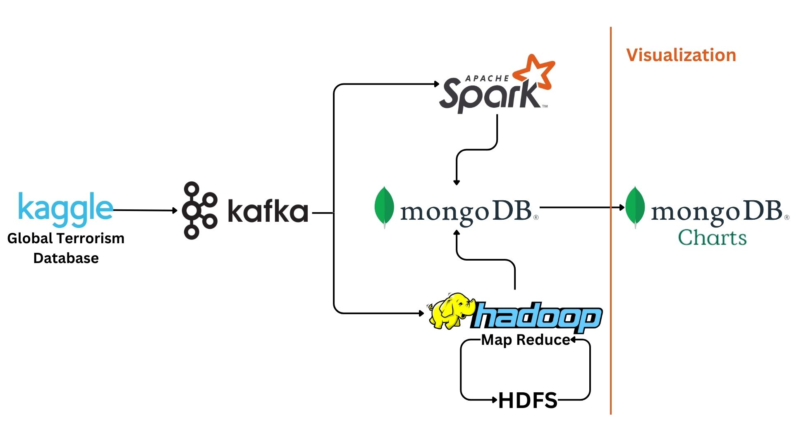

# BigData Project For Global Terrorism Database

Made by : 
[Amal Sammari](https://github.com/Amal1999)
[Safa Laabidi](https://github.com/safa-abidi)
[Ines Achour](https://github.com/inesachour)

In this project we made a pipeline to process the Global Terrorism Database (GTD) from Kaggle.

link : [https://www.kaggle.com/datasets/START-UMD/gtd].

The pipeline includes batch and stream processing that's why it's based on the Lambda Architecture.

## Architecure

### 1-Data Ingestion
 - Kafka
 
### 2-Data Processing 
 - Streaming : Spark Streaming
 - Batch : Hadoop MapReduce
 
 
### 3-Data Storage
 - Streaming : MongoDB
 - Batch : HDFS (data before processing) & MongoDB (data after processing)

### 4- Data Visualization
 - Dashboarding : MongoDB Charts

## Other

### Project Folders

#### 1- No Kafka And No MongoDB
 - GlobalTerrorism_Stream
 - GlobalTerrorism_Batch
 
#### 2- Kafka Without MongoDB
 - GlobalTerrorism_Kafka_Stream

#### 3- Kafka And MongoDB
 - GlobalTerrorism_Kafka_Batch : append the sent data from Kafka to the database csv file
 - GlobalTerrorism_Batch_MongoDB : launch the batch process on the csv database and save the result in MongoDB database
 - GlobalTerrorism_Kafka_MongoDB : receive streaming data, process them and save result in MongoDB database

Visualization : https://charts.mongodb.com/charts-globalterrorism-inmsa/public/dashboards/bcd6aeb2-f6f9-4aee-bbab-38f7e0b60851
